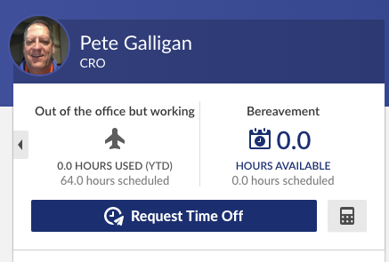
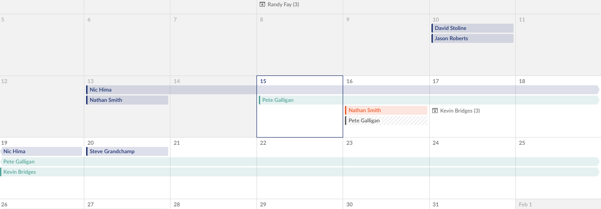

# Out of the Office but Working Policy

"Out of the Office but Working" is our policy for communicating our work location when we plan to work outside of our home city for more than five hours. 

## Why is this a good idea?

- Collaboration/Transparency: Sharing your work location helps team members know where you are, and coordinate schedules for meetings, standups, etc. 
- Courtesy: Who really wants a Slack message alert at 3 AM local time?
- Safety: In the event of an emergency situation during work hours where you need our help, we’ll know where you are to assist you as best as we can.

## Who is required to post their time?

Everyone: Full-time employees, part-time employees, and full-time contractors 

## How do I post my time?

- Log in to [BambooHR](https://drud.bamboohr.com/) (at least three days prior to your departure)
- Click on "Request Time Off" 
- Input the dates that you will be working in another city
- Select "Out of the Office but Working" from the "Time off type" dropdown menu
- In the "Note" section type your City, State, and Country location and your anticipated work schedule (e.g., 8-5 Eastern Time)
- Click on "Send Request"
  - Your request will be routed to your manager for approval. This is more of an acknowledgment than approval. Keep in mind, if the team has an upcoming deadline, your manager may discuss your request with you given company priorities.
  - This does not get deducted from your paid time off (PTO) balance. It’s just a way to improve our communication, transparency, and collaboration.
- Double-check your Emergency Contact information in BambooHR to ensure it is current (Click on "My Info" in the top navigation, then select the "Emergency" tab)

## Where can I see who is "Out of the Office but Working?"

"Out of the Office but Working" time will be shared in BambooHR and on the "Who’s Out" calendar.

### BambooHR 

- From your home screen in BambooHR, roll your cursor over the "Who’s Out" section then a link to the "Full Calendar" will appear 
- Click on the "Full Calendar" link 
- "Out of the Office but Working" time is noted in green
- Click on the person's time off and a pop-up window appears
- In the pop-up window, click on the person’s name
- Scroll to the "History" section to see their location and working hours

### Who’s Out Calendar

"Out of the Office but Working" time will automatically populate on the "Who’s Out" calendar in your email client. 

## Things to note:
- Add your "Out of the Office but Working" time to BambooHR if you plan to work outside of your home city for five hours or more including when you are attending work conferences/trade shows.
- If you are planning to work from a coffee shop or co-working space in your home city there is no need to record this time.
- This does not get deducted from your PTO balance. It’s just a way to improve our communication and collaboration.
- If you plan to collaborate in-person with your teammates during your "Out of the Office but Working" time, and you would like reimbursement from DDEV, you’ll need to get the expense approved prior to making plans. Download "Expense Approval Form."   
- If you plan to collaborate in-person with your teammates during your "Out of the Office but Working" time and you are willing to cover the expense, just complete the BambooHR steps noted above.

Questions? Reach out to Pete Galligan.
