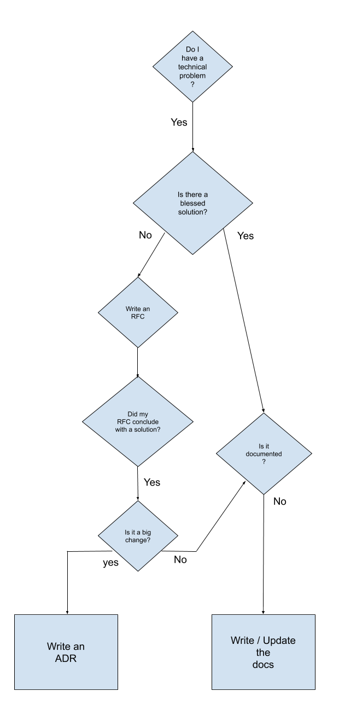

# Technical Planning Docs
## Request for Comment
In the course of planning development, there are often scenarios where a technology or implementation decision fork is presented and an engineer wants to solicit ideas or feedback. 

Writing a full-blown Architectural Decision Record may not appropriate as that document requires significant overhead in proposing answers that still may be largely unknown. In most cases, we only want to invest the time in writing an ADR only when a decision has been made and needs to be codified. Until then, it's a Decision Proposal, not a Decision Record.

Instead we use a Request for Comment markdown template that is more lightweight and speculative. It is designed to generate conversation and rapid feedback when there is not a clear solution with any level of certainty.

RFCs live as PR templates in the ddev-live docs repo.

An RFC template contains the following fields:
* The Problem
* Potential Solutions (if any)
* Areas of Potential Impact (on the platform, company etc.)
* How I Will Know I’ve Solved the Problem

Workflow:
* Open an RFC template PR in ddev-live with the 4 fields populated
* Link the PR to the original source issue that led to the RFC
* The PR stays open for a minimum of 2 business days to give others time to comment
* Comments/discussion occurs on the PR and/or in the RFC PR thread
* Once there's a conclusion reached for next steps on the RFC PR, incorporate those into the RFC PR
* Close or merge the PR for memorialization

The outcome of a RFC could be one or more of several paths.

* It could close with no action taken.
* It could solidify consensus around a proposed solution.
* It could lead to a spike of work to investigate further.
* It could generate the initial discovery for an ADR.
* It could lead to technical documentation.

Borrowing from this [Spotify diagram](https://engineering.atspotify.com/2020/04/14/when-should-i-write-an-architecture-decision-record), the flow is: 

